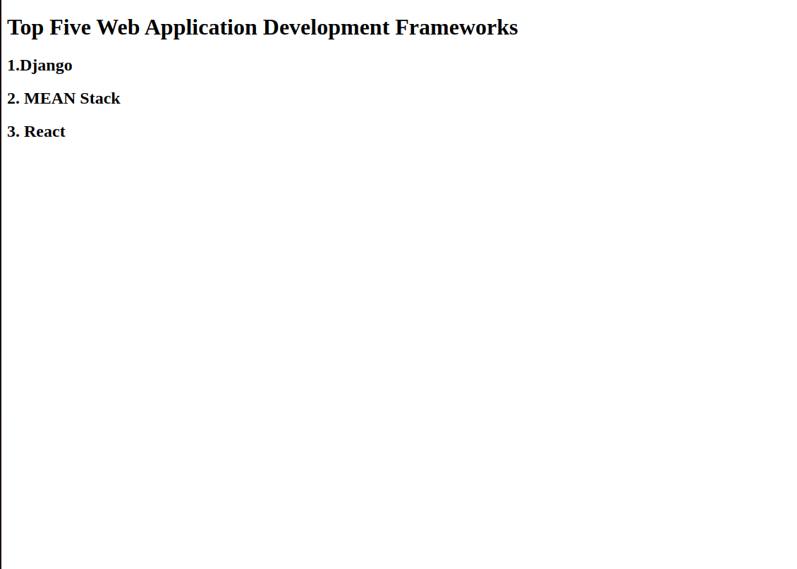
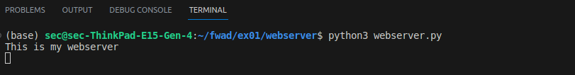

# Developing a Simple Webserver

# AIM:

To develop a simple webserver to serve html programming pages.
# Algorithm:
```
1.Install Visual Studio Code if you haven't already.
2.Install the Python extension for VS Code.
3.Open VS Code and create a new folder for your project.
4.Inside the project folder, create a new file named app.py.
5.Install Flask by opening a terminal in VS Code and running pip install flask.
6.Write the following code in app.py:
```
## PROGRAM:
```python
from http.server import HTTPServer,BaseHTTPRequestHandler

content='''
<!doctype html>
<html>
<head>
<title> My Web Server</title>
</head>
<body>
<h1>Top Five Web Application Development Frameworks</h1>
<h2>1.Django</h2>
<h2>2. MEAN Stack</h2>
<h2>3. React </h2>
</body>
</html>
'''

class MyServer(BaseHTTPRequestHandler):
    def do_GET(self):
        print("Get request received...")
        self.send_response(200) 
        self.send_header("content-type", "text/html")       
        self.end_headers()
        self.wfile.write(content.encode())

print("This is my webserver") 
server_address =('',8000)
httpd = HTTPServer(server_address,MyServer)
httpd.serve_forever()
```
## OUTPUT:



## RESULT:
The program is executed succesfully
